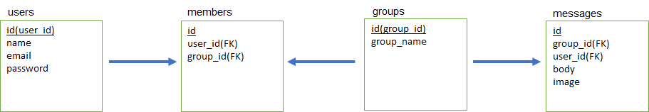

#### memo	
	
	
# usersテーブル	
|Column|Type|Options|	
|-------|----|-------|	
user_id|integer|index	
name|varchar|null: false, unique: true	
email|varchar|null: false, unique: true	
password|varchar|null: false	
	
## Association	
-	has_many: user_groups
-	has_many: messages
	
	
# user_groupsテーブル	
|Column|Type|Options|	
|-------|----|-------|	
id|integer|	
user_id|integer|null: false, foreign_key: true	
group_id|integer|null: false, foreign_key: true	
	
## Association	
-	belongs_to: user
-	belongs_to: group
	
	
# groupsテーブル	
|Column|Type|Options|	
|-------|----|-------|	
group_id|integer|
group_name|varchar|null: false, unique: true	
	
## Association	
-	has_many: user_groups
-	has_many: messages
	
	
# messagesテーブル	
|Column|Type|Options|	
|-------|----|-------|	
message_id|integer|	
group_id|integer|null: false, foreign_key: true	
user_id|integer|null: false, foreign_key: true	
message|varchar|	
image|varchar|	
	
## Association	
-	belongs_to: user
-	belongs_to: group

